# Reader

只為了讀取EDID而誕生的讀取器

## 讀取數據

我提供了以下資料，詳情參考`EDID解析器`simple的那個

* Product Name - 顯示器的產品名稱，方便辨識
* EDID Raw Data - 格式化後的EDID原始資料

## What's New

V1.1:

* 新增:EDID獨立顯示功能

    1. 點選下拉選單，挑選想單獨顯示的顯示器(以ASUS VG27V為例)
        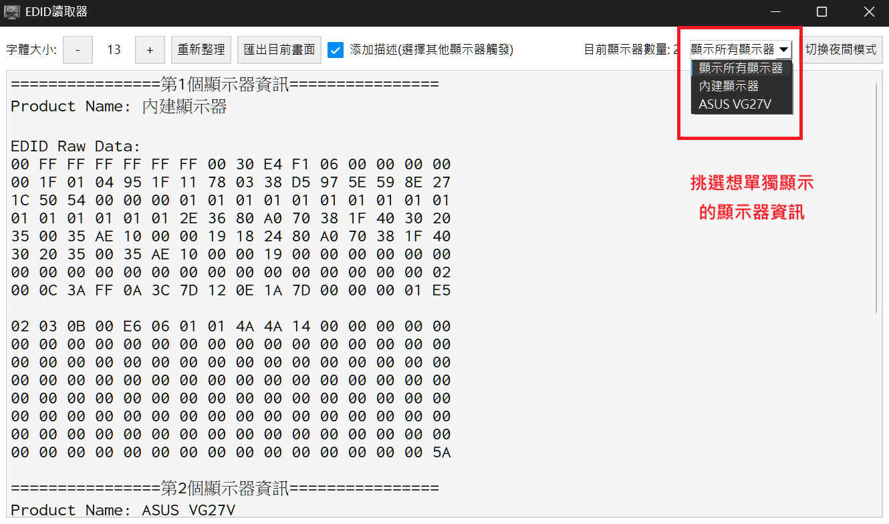
    2. 選擇顯示器後，畫面就會只保留該顯示器的資訊
        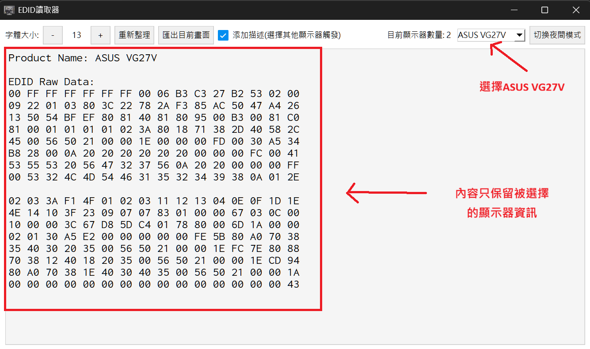
* 新增:可自行勾選是否加入顯示器描述

    1. 取消勾選`添加描述`，挑選單一顯示器(僅支援個別顯示器)
        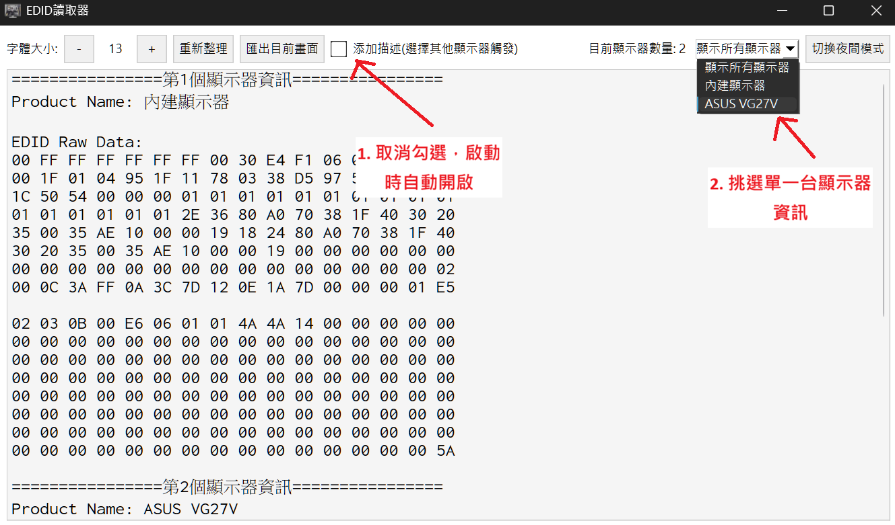
    2. 內容會更新為無其他描述的EDID
        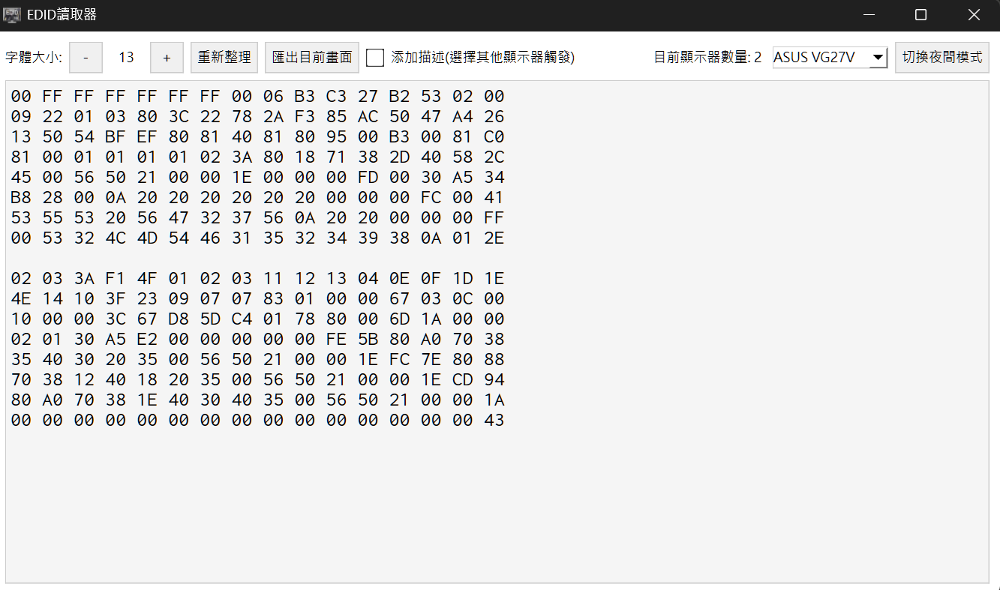
* 修改:匯出時，自動帶入即將匯出的顯示器名稱
    1. 按下匯出即可匯出目前畫面上的內容
        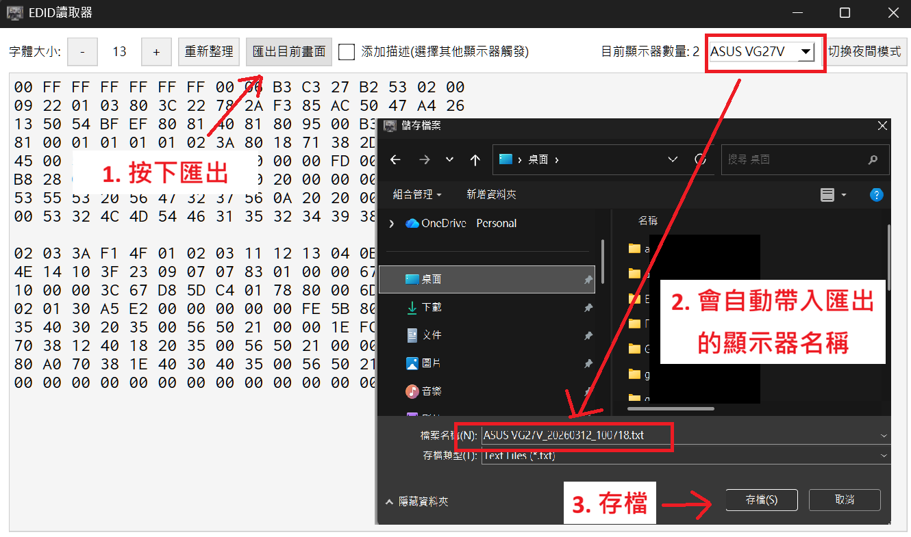
    2. 匯出成功後，會提供匯出的相關資訊
        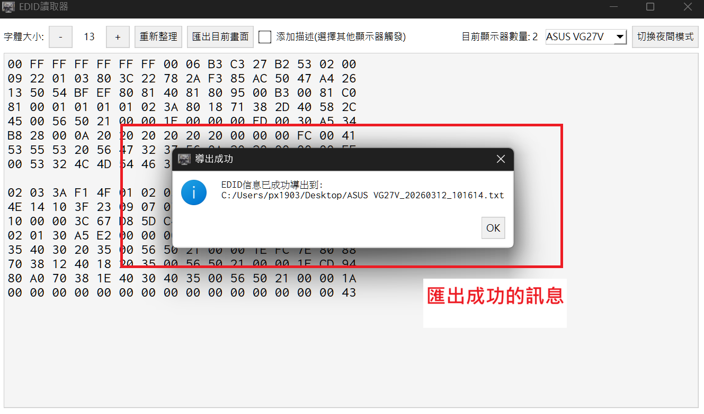
        匯出內容與畫面是相同的
        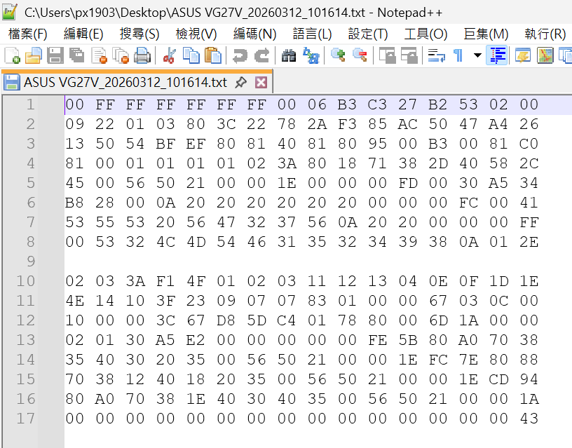
    3. 當選擇所有顯示器匯出時，會帶入所有顯示器的資訊

        現在畫面上有兩個顯示器，分別為`內建顯示器`、`ASUS VG27V`
        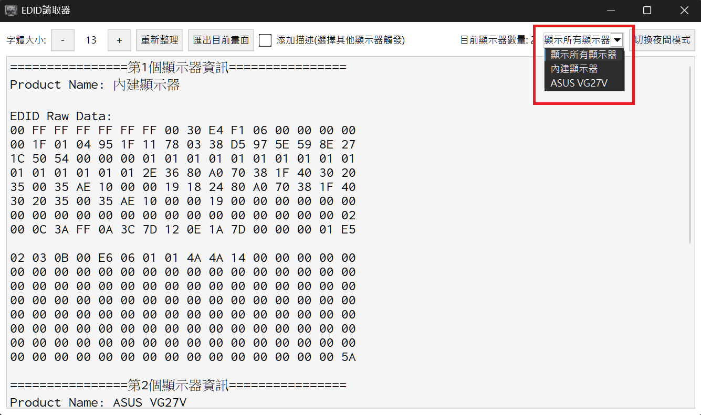

        匯出的名稱會自動帶入所有的顯示器名稱
        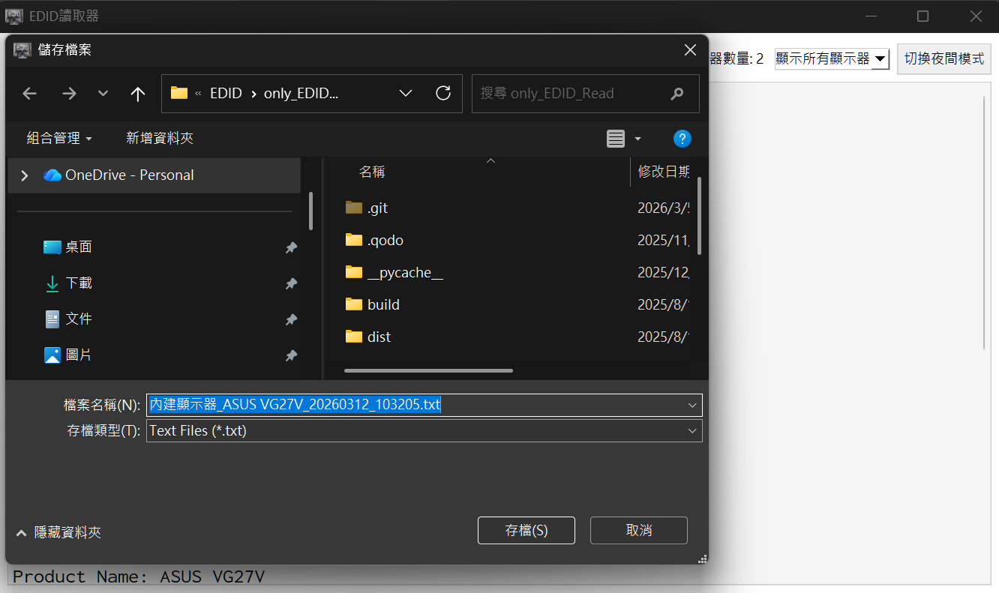

## 如何使用

1. 點開exe檔案

    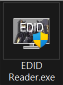

2. 啟用程式後，就會顯示讀取結果

    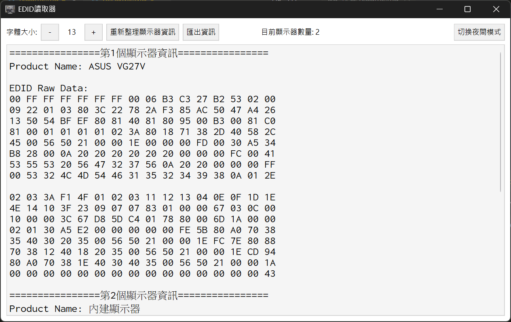

3. 按下`重新整理顯示器資訊`按鈕，可以重新讀取顯示器資料
4. 按下`匯出資訊`按鈕，可以會出現在畫面的內容以及匯出時間
    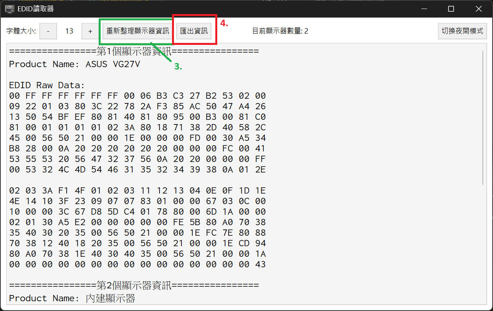

5. 點選`夜間模式`可以改變顏色配置，保護你的眼睛

    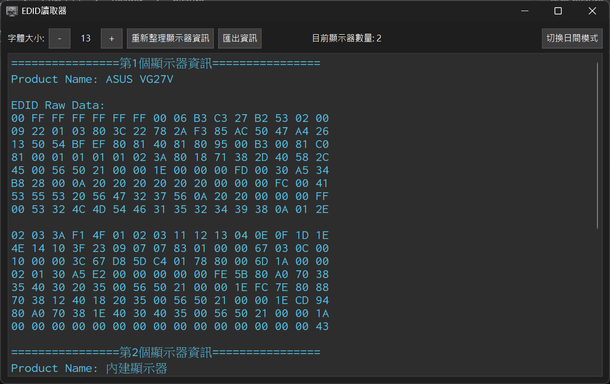

## hostory

V1.1:

* 新增:EDID獨立顯示功能
* 新增:可自行勾選是否加入顯示器描述
* 修改:匯出時，自動帶入即將匯出的顯示器名稱

V1.0:

* 初版發行
* 從簡易EDID解析器抽離讀取EDID功能
